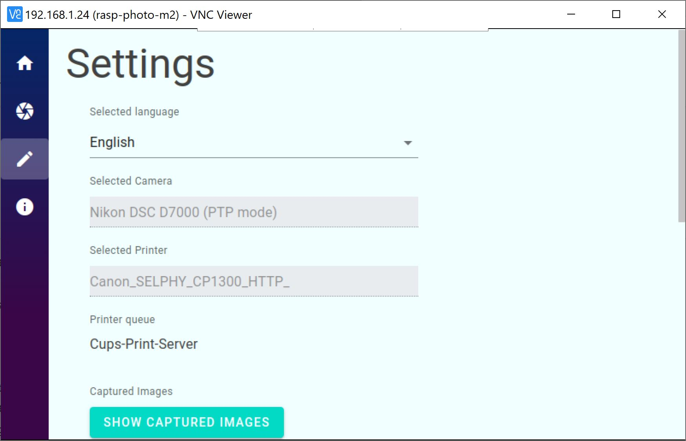

# Photoboot .Net

## Technology

The photobooth application is implemented in .Net 5 and uses blazor for the frontent (PWA).
This means the frontent can be used in any browser which has access to the raspberry.
Personally I use the Raspberry Pi touch panel and run the chromium browser directly in raspian.

## Setup

In my Setup I use:

* Raspberry Pi 4 4G
* Raspberry Pi 7" Touch
* Nikon D7000
* Canon SELPHY CP1300

## Screenshots

## Features

Version 1.0

- [x] Capture Countdown
- [x] Review Countdown
- [x] Capture Photo
- [x] Review
- [x] Print Photo
- [x] Settings (Countdown duration, rewviw quality, review size, ...)
- [x] Display printer queue
- [x] Clear Printer queue
- [x] Display captured image filenames
- [x] Remove captured image filenames
- [x] Display error messages
- [x] Localization en/de
- [x] File-Logging

Version 2.0

- [ ] Wizard to check printer, camera
- [ ] Trigger image by raspberry input
- [ ] Skip review count down
- [ ] Capture collage

Version 3.0

- [ ] Preview
- [ ] Display capture images
- [ ] Reprint captured images

## State-Machine

## Installation

[Install-Guide](doc/Install.md)