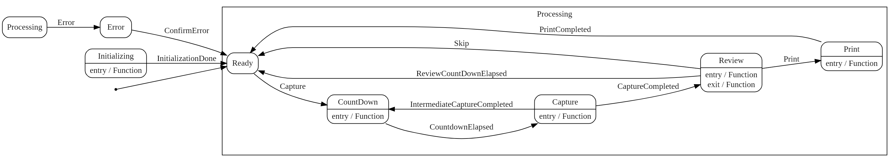

# Photoboot .Net

| Description | Link                                                                                                                                                                                                                                                                                                                                                                                                                                                                                                                                                                   |
| ----------- | ---------------------------------------------------------------------------------------------------------------------------------------------------------------------------------------------------------------------------------------------------------------------------------------------------------------------------------------------------------------------------------------------------------------------------------------------------------------------------------------------------------------------------------------------------------------------- |
| Sonarcloud  |    |
| Build       |                                                                                                                                                                                                                                                                                                                                                        |

## Technology

The photobooth application is implemented in .Net 6 and uses blazor webassembly for the frontent (PWA).
This means the frontent can be used in any browser which has access to the raspberry.
Personally I use the Raspberry Pi touch panel and run the chromium browser directly in raspian. The [cups print server](http://www.cups.org/) is used for printing. To control the camera I wrote a command line wrapper for [gphoto2](http://www.gphoto.org/).

## Setup

In my Setup I use:

* Raspberry Pi 4 4G
* Raspberry Pi 7" Touch
* Nikon D7000
* Canon SELPHY CP1300
* fantec WK-200

## Screenshots

| Topic    | Screenshot 1                                | Screenshot 2                                | Screenshot 3                           | Screenshot 4                           |
| -------- | ------------------------------------------- | ------------------------------------------- | -------------------------------------- | -------------------------------------- |
| Settings |     |                                             |                                        |                                        |
| Wizard   |       |       |  |  |
| Capture  |   |  |    |  |
| Error    |           |                                             |                                        |                                        |
| Progress |  |                                             |                                        |                                        |

## Features

Version 1.0

- [x] Capture Countdown
- [x] Review Countdown
- [x] Capture Photo
- [x] Review
- [x] Print Photo
- [x] Settings (Countdown duration, rewviw quality, review size, ...)
- [x] Display printer queue
- [x] Clear Printer queue
- [x] Display captured image filenames
- [x] Remove captured image filenames
- [x] Display error messages
- [x] Localization en/de
- [x] File-Logging

Version 2.0

- [x] .Net 6 aot
- [x] Wizard to check printer, camera
- [x] Trigger image by raspberry input
- [x] Support for two raspberry state outputs 
- [x] Skip review count down
- [x] Capture collage

Version 3.0

- [ ] Preview
- [ ] Display capture images
- [ ] Reprint captured images

## State-Machine

## Installation

[Install-Guide](doc/Install.md)

## Development

[Development-Guide](doc/development.md)